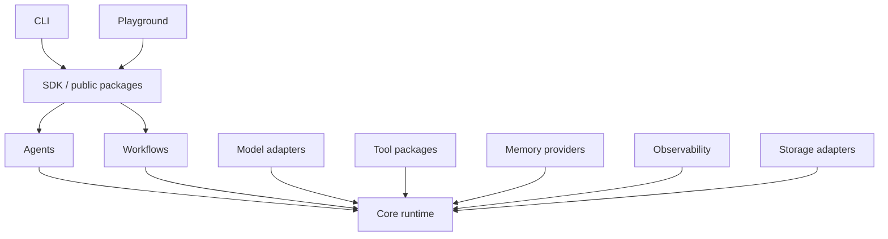

# AgentForge: Project Status, Product Definition, and Roadmap

Last updated: 2026-08-31 (v0.0.2 release: Phase 5 safety hardening, Phase 6 session depth, Phase 3 streaming/conformance, Phase 7 workflow documents)
Current version: `0.0.1`  
Repository status: active development / experimental

This document is the single, honest description of what AgentForge is, what has already been implemented, what is incomplete, how the repository can currently be used, and what must be completed before it can reasonably be described as a ready-to-use agent CLI and workflow platform.

## 1. Executive Summary

AgentForge is intended to become a model-agnostic AI agent framework, terminal agent, SDK, workflow engine, and visual workflow platform. Its target experience combines:

- A programmable TypeScript agent framework.
- A terminal experience inspired by tools such as Hermes Agent and Cursor CLI.
- A graph-based workflow runtime and editor.
- Provider-independent model integration.
- Safe, permission-controlled tools for files, HTTP requests, search, and shell commands.
- Persistent sessions, execution history, telemetry, and debugging.

The repository is **not an empty UI mockup**. It already contains a functioning agent runtime, provider adapters, tools, workflows, memory abstractions, observability, storage, CLI commands, examples, tests, CI configuration, and a playground API that can invoke the real runtime.

However, the repository is also **not yet a complete Hermes/Cursor CLI replacement**. The current CLI is primarily a one-shot runner and project-management interface. Interactive chat, repository-aware coding behavior, approval prompts, durable sessions, package publication, and full replacement of seeded playground data are still unfinished.

The correct current label is:

> AgentForge `0.1.0` is an experimental but functional agent framework foundation. Its public APIs and product experience are not yet production-stable.

## 2. Product Vision

The finished AgentForge product should let a developer:

1. Install one CLI.
2. Open any repository.
3. Select an AI provider and model.
4. Start an interactive agent session.
5. Let the agent inspect files, search code, propose changes, edit files, run tests, and execute approved commands.
6. Review every sensitive action before it occurs.
7. Resume previous sessions with full history.
8. Define reusable agents and tools in TypeScript.
9. Compose agents and tools into graph workflows.
10. Run the same workflow from the CLI, SDK, CI, API, or visual playground.
11. Inspect model usage, tool calls, errors, retries, timings, and cost.
12. Switch model providers without rewriting agent or workflow logic.

AgentForge must remain provider-neutral. OpenAI, Anthropic, Gemini, local models, and OpenAI-compatible endpoints should all be replaceable adapters rather than assumptions embedded in the runtime.

## 3. Product Surfaces

AgentForge has four intended product surfaces.

### 3.1 CLI

The CLI should provide an interactive terminal agent, automation commands, project scaffolding, diagnostics, workflow execution, session management, and run inspection.

### 3.2 TypeScript SDK

The SDK should let applications define providers, agents, tools, memory, workflows, storage, and observability integrations through strongly typed APIs.

### 3.3 Workflow Runtime

The workflow engine should execute persisted graph definitions with branching, parallel execution, retries, cancellation, human approval, and resumable state.

### 3.4 Playground

The playground should be a real operational interface over the same runtime and storage used by the CLI and SDK. It should not maintain a separate fake execution model.

## 4. Repository Architecture

The project uses a TypeScript monorepo managed with pnpm and Turborepo.

```text
agentforge/
├── apps/
│   ├── docs/                 Documentation application
│   └── playground/           Next.js workflow and run interface
├── packages/
│   ├── core/                 Agent runtime, shared contracts, errors, events
│   ├── agents/               Agent factories and registry
│   ├── models/               Model provider adapters
│   ├── tools/                Tool definitions and built-in tools
│   ├── workflows/            Graph workflow runtime
│   ├── memory/               Memory provider implementations
│   ├── observability/        Logging and telemetry sinks
│   ├── storage/              Run persistence and database-oriented storage
│   ├── cli/                  Command-line application
│   └── sdk/                  Consolidated developer-facing exports
├── examples/
│   └── showcase/             Runnable provider, tool, memory, and workflow examples
├── .github/                  CI and contribution templates
├── README.md
├── CONTRIBUTING.md
├── SECURITY.md
├── CHANGELOG.md
└── PROJECT_STATUS_AND_ROADMAP.md
```

### 4.1 Dependency Direction

The intended dependency flow is:



Provider-specific code should remain isolated inside the models package. The core runtime should only depend on provider-independent contracts.

## 5. Package Inventory

| Package | Purpose | Current state |
| --- | --- | --- |
| `@agentforge/core` | Agent loop, shared types, errors, event bus, run IDs | Functional |
| `@agentforge/agents` | Agent factory and registry | Functional, intentionally small |
| `@agentforge/models` | OpenAI, Anthropic, Gemini, and mock model adapters | Functional baseline; streaming/tool parity incomplete |
| `@agentforge/tools` | Typed tools, validation, permissions, safety controls | Functional baseline + repository coding tools (list/read/search/patch/git-diff/run) |
| `@agentforge/workflows` | Graph execution, branching, parallel work, retries | Functional baseline |
| `@agentforge/memory` | In-memory and PostgreSQL-oriented memory | Functional baseline; vector retrieval not implemented |
| `@agentforge/observability` | Structured events, console/storage sinks, redaction | Functional baseline |
| `@agentforge/storage` | Run persistence and database-oriented stores | Functional baseline; operational hardening remains |
| `@agentforge/cli` | Project scaffolding, execution, diagnostics, inspection | Functional one-shot CLI; interactive agent unfinished |
| `@agentforge/sdk` | Consolidated developer API | Functional baseline |
| `@agentforge/playground` | Visual interface and runtime API | Mixed: real execution API, partially seeded UI |
| docs app | Static project documentation | Present; expansion and synchronization required |

## 6. What Is Actually Implemented

### 6.1 Agent Runtime

The core agent runtime currently supports:

- Unique run IDs.
- System instructions and user input.
- Iterative model execution.
- Model-request retries.
- Tool/function calls.
- Tool result messages returned to the model.
- Configurable maximum iterations.
- Execution timeouts.
- `AbortSignal` cancellation.
- Structured-output validation for JSON responses.
- Token-usage aggregation.
- Run duration measurement.
- Typed runtime errors.
- Agent lifecycle events.
- A basic streaming path for models that implement streaming and agents without tools.

The tool loop is real: a model may request a tool, the runtime validates and executes it, the result is added to the conversation, and the model is invoked again until it produces a final response or reaches the iteration limit.

### 6.2 Model Providers

Implemented provider adapters include:

- OpenAI chat-completions-compatible provider.
- Anthropic Messages API provider.
- Google Gemini provider.
- Deterministic mock provider for offline development and CI.
- A `createModel` provider factory.
- Provider metadata and token usage mapping.
- Tool-call parsing for supported provider response formats.
- API keys obtained from options or environment variables rather than source code.

Current limitations include inconsistent feature parity between providers, incomplete streaming, and incomplete normalization of complex multimodal/provider-specific content. Custom and proxy endpoints are now first-class: an `openai-compatible` provider kind plus `createConfiguredModel()` let every protocol target a custom `baseUrl` with environment-based credentials (see CHANGELOG).

### 6.3 Tool System

The tool layer currently provides:

- Strongly typed tool definitions.
- Zod input validation.
- Tool metadata.
- Tool retries.
- Tool-level timeouts.
- Permission declarations.
- Runtime permission allowlists.
- Tool lifecycle events.
- Error capture and reporting.
- Security-oriented boundaries for dangerous tools.
- Built-in/example capabilities for HTTP, files, calculator behavior, shell execution, mocked web search, and JSON transformation.

Shell and filesystem functionality must remain explicit opt-in capabilities. The finished CLI must request user approval before executing dangerous operations.

### 6.4 Workflow Engine

The workflow runtime currently supports a graph-oriented execution model with:

- Sequential node execution.
- Transform nodes.
- Conditions and branching.
- Parallel execution.
- Retry behavior.
- Cancellation.
- Shared workflow state.
- Workflow lifecycle events.
- Execution history structures.

The long-term node catalog includes input, output, agent, model, tool, transform, condition, parallel, and human-approval nodes. Human approval and durable pause/resume behavior require further productization.

### 6.5 Memory

The memory layer includes:

- A provider abstraction.
- In-memory operation for tests and local development.
- PostgreSQL-oriented persistence.
- Conversation, working, and long-term memory concepts.
- An architecture that can later accept vector or hybrid retrieval providers.

Vector embeddings, semantic retrieval, ranking, memory summarization, and production retention policies remain future work.

### 6.6 Observability

Implemented telemetry concepts include:

- Run ID and agent identity.
- Provider and model identity.
- Timestamps and latency.
- Token usage.
- Tool calls.
- Errors and retry events.
- Workflow and node events.
- Console event output.
- Storage-backed event sinks.
- Basic secret redaction.

Implemented event names include:

- `agent.started`
- `model.requested`
- `model.completed`
- `tool.started`
- `tool.completed`
- `tool.failed`
- `agent.completed`
- `agent.failed`
- workflow and workflow-node lifecycle events

Cost estimation, OpenTelemetry export, trace visualization, and production dashboards remain incomplete.

### 6.7 Storage

The storage design covers:

- Runs.
- Agents.
- Messages.
- Tool calls.
- Workflow executions.
- Events.
- Usage data.
- In-memory/local development alternatives.
- PostgreSQL-oriented storage and migrations.

Storage still needs stronger migration verification, concurrency testing, retention controls, transaction boundaries, and a single fully integrated default used by both the CLI and playground.

### 6.8 CLI

Currently implemented commands include:

```text
agentforge init <name|.>
agentforge dev
agentforge run [entry]
agentforge test [patterns]
agentforge inspect <run-id>
agentforge providers
agentforge tools
agentforge workflows
agentforge doctor
```

Current CLI features include:

- Configuration discovery.
- Configurable entrypoints.
- TypeScript entrypoint loading through `tsx`.
- Input through `--input` or stdin.
- JSON output where supported.
- `--cwd` project selection.
- Node, configuration, entrypoint, and provider diagnostics.
- Signal forwarding to child development/test processes.
- Project scaffolding.
- Local monorepo package linking for unpublished development packages.
- Run inspection through configured storage or local run files.

Interactive capabilities added since the initial baseline:

- `agentforge chat` renders an Ink-based terminal UI on TTYs and a plain readline mode otherwise (also via `--plain`). Projects can export `createSession()` for real multi-turn context; one-shot entrypoints fall back to transcript replay.
- Plain-mode chat supports streaming deltas, per-turn run/provider/model/duration/token footers, multiline input with a trailing `\`, per-turn Ctrl-C cancellation, double Ctrl-C exit, and piped non-interactive scripting.
- Slash commands in plain mode: `/help`, `/status`, `/providers`, `/tools`, `/workflows`, `/models`, `/model <name>`, `/connect <provider>`, `/clear`, `/exit`.
- `agentforge models list` reports built-in and project-configured providers, credential readiness, default models, and current session selection; `--json` is supported.
- Entrypoint-not-found errors include the resolved absolute path, discovered config path, and `--cwd`/`doctor` guidance.
- Scaffolding generates `.gitignore`, `.env.example`, working `test` and `typecheck` scripts, `@types/node`, a streaming mock model, and a multi-turn session test. Local-link scaffolds emit `pnpm.overrides` so generated projects install cleanly despite unpublished packages; this was verified end to end offline (scaffold → install → typecheck → tests → two-turn mock chat).
- Managed custom endpoints: `agentforge providers add/remove/list` maintain `.agentforge/providers.json`; entries merge into project config at load time and are resolved by scaffolded projects when `AGENTFORGE_PROVIDER` names them.

Status (2026-08-30): durable named sessions and resume have landed (`agentforge sessions list|resume|delete`, `/sessions` `/resume` `/new`; transcripts autosave to project and global stores), and the repository coding toolset is wired into live sessions with permission modes, in-TUI approval cards, and per-turn git diff summaries. Still missing on the interactive path: provider streaming/conformance work, context compaction, and full replacement of seeded playground data.

### 6.9 Playground

The playground includes:

- A Next.js application.
- Dark-first developer-product styling.
- Workflow-oriented interface concepts.
- Sections for dashboards, workflows, agents, runs, tools, models, and settings.
- A real API route capable of invoking AgentForge runtime/workflow packages.
- Provider-aware execution: POST bodies select `provider`/`model`/`baseUrl`/`apiKeyEnv`; requests resolve against server-side environment credentials only (raw keys are never accepted over HTTP), and missing configuration returns a 400 naming the required variable.
- File-backed run history via `JsonlRunStore` plus a `GET /api/runs` endpoint; the UI loads persisted history on mount.
- Settings fields for custom OpenAI-compatible endpoints; unimplemented sidebar controls are disabled and labeled.

The remaining limitation is that some interface concepts beyond the agent console remain visual-only (workflow authoring, environment inspection), and mock-provider cost figures use placeholder rates. The playground must not be advertised as a complete visual workflow platform until those are replaced.

### 6.10 Examples and Open-Source Setup

The repository includes runnable examples covering:

- A basic agent.
- A custom tool.
- A workflow.
- Multi-agent composition.
- A custom model provider.
- A custom memory provider.

It also includes:

- CI configuration.
- Issue templates.
- Pull request template.
- Contribution guidelines.
- Code of conduct.
- Security policy.
- Changelog.
- License.

## 7. What Is Mocked, Seeded, or Incomplete

This section exists to prevent accidental overclaiming.

### 7.1 Deterministic Mock Model

The generated starter project defaults to a deterministic mock model. This is intentional so examples and CI can run without paid credentials. It does not represent a capable autonomous model and should be clearly labeled as offline development mode.

Using a mock provider is acceptable for testing. Presenting mock responses as real AI behavior is not acceptable.

### 7.2 Seeded Playground Data

Earlier revisions displayed seeded dashboard data. The current playground console starts from an honest empty state, loads real persisted runs from the JSONL store, and disables controls without backends. Mock-provider cost figures still use placeholder rates rather than a provider cost table.

### 7.3 Unpublished Packages

The AgentForge packages are not currently published to npm. Therefore, a command such as:

```bash
pnpm add @agentforge/cli
```

cannot yet be treated as the supported public installation method.

Local repository linking is the current development path.

### 7.4 One-Shot CLI

`agentforge run` invokes an entrypoint once and remains intentionally headless for scripts and CI. `agentforge chat` now provides an interactive session experience, but durable named sessions, resume, and repository-aware coding behavior described below are still missing, so the CLI is not yet a full coding-agent shell.

### 7.5 Missing Coding-Agent Capabilities

The following capabilities are not yet complete. (Status 2026-08-30: interactive multi-turn terminal chat, durable named sessions and resume, patch preview with approval, interactive shell-command approval, git-aware diff summaries, and model switching during a session have landed and are no longer listed here.)

- Repository indexing and context selection.
- Rich code search UX.
- Safe file-edit transaction handling beyond dry-run validation.
- Automatic test/fix loops with explicit limits.
- Context compaction for long sessions.
- Full terminal streaming polish and live tool-status display edge cases.

## 8. Current CLI Usage

### 8.1 Working Inside This Repository

Install dependencies and build:

```bash
pnpm install
pnpm build
```

Display CLI help without global installation:

```bash
node packages/cli/dist/bin.js --help
```

Run the CLI from source during development:

```bash
pnpm --filter @agentforge/cli dev -- --help
```

### 8.2 Create a Locally Linked Agent Project

Until packages are published, use the repository-local CLI and local package links:

```bash
node /absolute/path/to/agentforge/packages/cli/dist/bin.js \
  init my-agent \
  --local-root /absolute/path/to/agentforge

cd my-agent
pnpm install
pnpm run run -- --input "Hello"
```

From this repository specifically, the CLI path is:

```bash
node /root/mura/packages/cli/dist/bin.js init my-agent --local-root /root/mura
```

This local absolute path is a development instruction, not the intended final public installation experience.

### 8.3 Existing Project Configuration

A minimal configuration looks like:

```ts
import type { AgentForgeConfig } from '@agentforge/cli';

const config: AgentForgeConfig = {
  name: 'my-agent',
  entry: 'src/agent.ts',
  providers: ['mock'],
  tools: [],
  workflows: [],
};

export default config;
```

The entrypoint must exist relative to the project directory. If the CLI prints:

```text
Entrypoint not found: src/agent.ts
```

then the command is being run from the wrong directory, the config points to the wrong file, or the scaffold did not create the entrypoint. Diagnose it with:

```bash
agentforge doctor
```

or run against a specific project:

```bash
agentforge --cwd /path/to/project doctor
```

## 9. Environment Variables

Current provider variables include:

| Variable | Purpose |
| --- | --- |
| `OPENAI_API_KEY` | OpenAI provider authentication |
| `ANTHROPIC_API_KEY` | Anthropic provider authentication |
| `GOOGLE_API_KEY` | Gemini provider authentication |
| `GEMINI_API_KEY` | Alternate Gemini provider variable |
| `AGENTFORGE_REPO_ROOT` | Optional local package-link source for CLI scaffolding |
| `NO_COLOR` | Disable CLI ANSI colors |

Database-backed installations may additionally require a PostgreSQL connection variable. The final canonical name must be standardized and documented before release.

Rules for secrets:

- Never commit `.env` files containing credentials.
- Never render credentials in the playground.
- Never include authorization headers in telemetry.
- Always redact provider keys and bearer tokens from logs and errors.
- Prefer environment injection or a secret manager in production.

## 10. Testing and Verification Status

The most recent reported verification before this document was created was:

| Check | Last known result |
| --- | --- |
| `pnpm install --frozen-lockfile` | Passed (2026-08-30, incl. new `@agentforge-oss/workflows` CLI dependency) |
| `turbo run typecheck --concurrency=1` | Passed across 23 tasks (2026-08-30, after session/streaming/workflow work) |
| `turbo run lint --concurrency=1` | Passed across 23 tasks (2026-08-30, after session/streaming/workflow work) |
| `turbo run test --concurrency=1 --force` | Passed across 23 tasks (2026-08-30, after session/streaming/workflow work) |
| `turbo run build --concurrency=1 --force` | Passed across 14 tasks including the playground production build (2026-08-30, after session/streaming/workflow work) |
| Six showcase examples | Previously smoke-tested successfully; rerun pending |
| Built CLI help | Working, includes `chat`, `models list`, `models test`, `providers add/remove/list`, `sessions rename/export/prune`, `permissions`, `workflows validate` |
| Generated project scaffold | Files, local dependency links, offline install, typecheck, generated tests all verified (2026-08-23) |
| Custom proxy endpoint end to end | Verified: managed endpoint added via CLI, chat and one-shot runs forwarded to a local OpenAI-compatible stub with correct path, bearer token from env var name, and model id (2026-08-23) |

These results reflect the current checkout. They are point-in-time status, not a standing guarantee; rerun gates after further changes. On RAM-constrained proot/Termux environments run turbo serially (`--concurrency=1`) to avoid out-of-memory crashes.

### 10.1 Required Final Quality Gate

Before calling a release ready, all of the following must pass from a clean clone:

- [ ] `pnpm install`
- [ ] `pnpm lint`
- [ ] `pnpm typecheck`
- [ ] `pnpm test`
- [ ] `pnpm build`
- [ ] All examples run using the deterministic provider
- [ ] At least one optional real-provider smoke test passes
- [ ] Generated project installs and runs
- [ ] Interactive CLI starts and completes a session
- [ ] CLI cancellation works
- [ ] Safe file read/search works
- [ ] File modification requires approval and produces a reviewable diff
- [ ] Shell execution requires approval and respects restrictions
- [ ] Workflow branching, parallel execution, retries, and cancellation pass
- [ ] Storage migrations apply to a fresh database
- [ ] Playground reads real storage-backed runs
- [ ] Playground workflow execution works
- [ ] Documentation builds
- [ ] GitHub Actions pass
- [ ] Secret scan passes
- [ ] No misleading fake metrics remain in production routes
- [ ] No critical placeholder or unimplemented public controls remain

## 11. Known Problems

### 11.1 Entrypoint Confusion

The CLI assumes an entrypoint relative to the active project directory. Running it from the monorepo root against a generated-project configuration can cause `Entrypoint not found: src/agent.ts`.

Planned correction:

- Improve error output with the resolved absolute path.
- Print the discovered configuration path.
- Suggest `--cwd` when appropriate.
- Make `doctor` part of the scaffold handoff.
- Add tests for config-relative and working-directory behavior.

Status (2026-08-23): the entrypoint error now reports the resolved absolute path and the discovered config path, suggests running from the project directory or passing `--cwd`, and `doctor` shows the resolved entrypoint path. Covered by CLI tests for both with-config and no-config cases. The `--cwd`-flag-specific test and scaffold-handoff integration remain open.

### 11.2 Scaffold Installation Messaging

The scaffold previously printed npm-based instructions even though this repository uses pnpm and its packages are unpublished.

Planned correction:

- Print pnpm instructions.
- Distinguish local-link mode from published-package mode.
- Verify the exact generated commands in integration tests.

Status (2026-08-23): the generated README and `init` output now use pnpm with `pnpm exec agentforge` in local-link mode (including an explicit local-link notice) and npm/npx only for published-package mode. Unit tests assert the generated commands, dependency links, and README text; a manual end-to-end verification (scaffold, install, doctor, mock run) passed. An automated install-and-run integration test is still open.

### 11.3 Provider Feature Parity

Provider adapters do not yet offer identical streaming, tool-call, structured-output, error, and metadata behavior.

Planned correction:

- Define a provider conformance test suite.
- Test every adapter with recorded or mocked HTTP fixtures.
- Normalize retryable errors and rate-limit metadata.
- Add OpenAI-compatible local endpoint support as an explicit adapter/configuration mode. (Done: `openai-compatible` kind, managed endpoints, playground support; recorded-fetch conformance fixtures cover base-URL routing, auth, and model id for every protocol. Full streaming/tool-call conformance parity remains open.)

### 11.4 Playground Data Integrity

The playground combines real runtime execution with seeded views.

Planned correction:

- Introduce storage-backed APIs for every run, usage, tool, workflow, and model view.
- Remove or explicitly label all sample data.
- Disable controls that do not have a real backend implementation.

### 11.5 Session Continuity

The CLI now maintains durable multi-turn sessions.

Planned correction:

- Add a session store. (Done 2026-08-30: JSONL stores under `.agentforge/sessions/` project-local and `~/.agentforge/sessions/` global; newest transcript restores on launch.)
- Pass prior conversation state into subsequent turns. (Done: `createSession()` contract plus autosave/resume.)
- Support `new`, `list`, `resume`, `rename`, and `delete` session operations. (Partial: `new`, `list`, `resume`, `delete` landed via `agentforge sessions` and chat slash commands; `rename` open.)
- Add context limits, summarization, and compaction. (Open.)

Status (2026-08-30): sessions survive restarts with validated ids and merged project-over-global ordering. Landed: `rename`, `export` (md/json), `prune` with retention/dry-run, context compaction (rolling summary + bounded tail, live-view preserved), and `inspect` recognizing stored sessions. Still open: SQLite default store, budget-based retention policy surface.

## 12. Target CLI Experience

The planned terminal interface should support:

```text
agentforge                       Start interactive mode in the current repository
agentforge chat                  Start a new interactive session
agentforge chat --resume <id>    Resume a previous session
agentforge run --input "..."    Execute one headless turn
agentforge exec workflow-name    Execute a configured workflow
agentforge sessions              List sessions
agentforge inspect <run-id>      Inspect a run and its events
agentforge models                List and test model configurations
agentforge tools                 List tools and permissions
agentforge doctor                Validate the environment and project
agentforge init                  Initialize AgentForge in a repository
agentforge dev                   Start the local playground and runtime services
```

### 12.1 Interactive Session Behavior

A real session should provide:

- Streaming assistant output.
- Visible model/provider selection.
- Conversation history.
- Repository context.
- Live status for model and tool operations.
- Token and cost summary.
- Ctrl-C cancellation without corrupting the session.
- Slash commands such as `/help`, `/model`, `/tools`, `/status`, `/clear`, `/compact`, and `/exit`.
- Safe multiline input.
- Non-interactive compatibility for scripts and CI.

### 12.2 Coding-Agent Tools

The initial coding toolset should include:

- `list_files`
- `read_file`
- `search_text`
- `inspect_git_diff`
- `apply_patch`
- `run_command`
- `run_tests`

Safety requirements:

- Read operations may be allowed by default inside the selected workspace.
- Writes must be limited to the selected workspace.
- File changes must show a diff before or immediately after application.
- Commands must be shown before execution.
- Dangerous commands must be blocked or require elevated approval.
- Network access should be a separate permission.
- Secrets and ignored files require additional protection.
- Every action must be attached to a run and session ID.

### 12.3 Permission Modes

The CLI should support explicit policies such as:

| Mode | Behavior |
| --- | --- |
| `read-only` | Repository inspection only |
| `ask` | Ask before every mutation or command |
| `workspace-write` | Allow scoped file edits, ask for shell/network |
| `trusted` | Allow configured capabilities inside strict boundaries |

`ask` should be the normal default for an interactive coding-agent session.

## 13. Roadmap

The roadmap is ordered by dependency and user value. Later phases must not be used to hide failures in earlier foundations.

### Phase 0: Restore a Reproducible Baseline

Goal: ensure the repository is green before expanding functionality.

- [x] Run a fresh `pnpm install` from the lockfile. (Re-verified 2026-08-30 with `--frozen-lockfile`.)
- [x] Run lint, typecheck, tests, and full build. (Re-verified 2026-08-30: typecheck 23/23, lint 23/23, test 23/23, build 14/14 including the playground production build, run serially on the constrained device.)
- [x] Fix any failures without disabling checks.
- [x] Add missing CLI tests for `init .`, `--cwd`, `doctor`, and local links. (2026-08-30: `doctor --json`, `--cwd` targeting + config-relative run, `init .` derivation; local links covered by scaffold tests.)
- [ ] Perform all example smoke tests.
- [x] Record exact supported Node and pnpm versions.
- [x] Verify no secrets or generated build artifacts are accidentally tracked.

Exit condition: clean clone plus documented commands produces a passing build.

### Phase 1: Make Project Scaffolding Reliably Usable

Goal: a generated local project works without manual repair.

- [x] Correct all scaffold output to use pnpm.
- [x] Generate truthful local-link versus published-package instructions.
- [x] Improve missing-entrypoint diagnostics.
- [x] Generate `.gitignore` and `.env.example`. (Done; scaffold ships both.)
- [x] Generate provider-selection examples.
- [x] Add a working test and typecheck script to generated projects. (Done; verified offline end to end.)
- [ ] Add an integration test that scaffolds, installs, runs, and validates output.
- [ ] Add `agentforge init .` coverage. (Done 2026-08-30: scaffold `.` name derivation covered; CLI-command-level `init .` flow remains untested.)

Exit condition: a temporary generated project installs and completes a mock agent run using only documented commands.

### Phase 2: Interactive Terminal Agent

Goal: replace the one-shot-only experience with a useful terminal session.

- [x] Implement `agentforge chat`. (Ink UI on TTYs, plain readline mode otherwise.)
- [x] Make the bare `agentforge` command enter interactive mode when appropriate. (Chat-first TUI; non-TTY/headless falls back to classic CLI.)
- [x] Add multiline input and terminal-safe prompts.
- [x] Add Ctrl-C turn cancellation and graceful second-interrupt exit.
- [x] Add streaming output.
- [x] Display run ID, provider, model, elapsed time, token usage, and tool status. (Per-turn footers plus live tool-event lines.)
- [x] Add slash commands. (22 commands in the TUI palette; plain-mode subset.)
- [x] Preserve conversation context between turns. (`createSession()` contract; autosave/resume.)
- [x] Retain `agentforge run` for non-interactive automation.
- [x] Add terminal integration tests with deterministic models. (Scaffold, entrypoint diagnostics, session contract, streaming runner suites.)

Exit condition: a user can hold a multi-turn session, cancel a turn, and exit cleanly.

### Phase 3: Real Provider Configuration

Goal: make provider selection predictable and production-usable.

- [x] Add typed provider configuration to `agentforge.config.ts`. (Named entries with protocol/model/baseUrl/apiKeyEnv.)
- [x] Add a standard model-name configuration. (`config.model` string or `{ provider, model }`.)
- [x] Add `agentforge models list` and `agentforge models test`. (Test added 2026-08-30: one-shot probe with precise credential/HTTP failures.)
- [x] Implement streaming for supported providers. (2026-08-30: SSE streaming for OpenAI, Anthropic, Gemini, and openai-compatible with fragment tool-call assembly; fixture conformance.)
- [x] Complete tool-calling conformance tests. (2026-08-30: recorded fixtures for non-stream + streamed tool-call assembly per protocol; live-provider conformance still open.)
- [ ] Complete structured-output conformance tests.
- [x] Normalize provider errors, retry hints, and rate limits. (2026-08-30: `ModelHttpError` with status, retryable classification, and Retry-After parsing; core retry loop does not yet consume the hints.)
- [x] Add OpenAI-compatible/local endpoint support. (`openai-compatible` kind, managed endpoints, playground support.)
- [x] Never print API keys or authorization headers.

Exit condition: OpenAI, Anthropic, Gemini, mock, and at least one local/OpenAI-compatible endpoint satisfy a shared conformance suite.

### Phase 4: Repository-Aware Coding Agent

Goal: make AgentForge useful inside a real codebase.

- [x] Add workspace discovery and boundaries. (Workspace-scoped tools with path-escape denial.)
- [x] Add fast file listing and text search. (`list_files`, `search_text` — gitignore-aware, bounded.)
- [x] Add bounded file reading. (`read_file`.)
- [x] Respect `.gitignore` and configurable exclusions. (Respect done; a user-facing exclusion-config surface is still open.)
- [ ] Add token-aware repository context selection.
- [x] Add patch-based file editing. (`apply_patch` with dry-run validation.)
- [x] Add diff review. (`inspect_git_diff` plus per-turn diff summaries.)
- [x] Add Git status awareness. (Status/diff via `inspect_git_diff`.)
- [x] Add restricted command execution. (`run_command` allowlist + blocklist; `run_tests`.)
- [x] Add test-command discovery. (package.json script discovery in `run_tests`.)
- [x] Record all file and command operations as tool calls. (Routed through the core agent loop with tool events.)

Exit condition: the agent can inspect a repository, propose and apply a small reviewed patch, run a test, and summarize the resulting diff.

### Phase 5: Permission and Safety UX

Goal: sensitive capabilities are understandable and safe by default.

- [x] Add interactive approval prompts. (In-TUI approval card, landed with Milestone C.)
- [x] Add per-tool allow/deny rules. (2026-08-30: `.agentforge/permissions.json` + `agentforge permissions list|allow|deny|remove`; deny blocks in every mode, allow skips prompting, rules never bypass workspace path checks.)
- [x] Add session-only and persistent approvals. (Session-only via the approval card's "always"; persistent via project permission rules.)
- [x] Add read-only, ask, workspace-write, and trusted modes.
- [x] Block commands targeting paths outside the workspace. (2026-08-30: `run_command` rejects path-like arguments resolving outside the root — absolute paths, `..`, `~`, `--flag=/path` values.)
- [x] Block common destructive command patterns by default. (Blocklist extended 2026-08-30: rm against `~`/`*`/`.`/`..`/`$HOME`, `su`, `chown /`, `dd of=/dev/*`, shutdown family, `wipefs`, `curl|sh`.)
- [x] Add network permissions and host allowlists. (Tool-level `allowedHosts` + `network:http` permission gating; every redirect hop re-validated.)
- [x] Harden HTTP tools against SSRF and redirect bypasses. (2026-08-30: manual redirects with per-hop re-validation; encoded IPv4 literals canonicalized and privacy-checked.)
- [ ] Protect environment variables and ignored secret files. (Partial 2026-08-30: `read_file`/`search_text` refuse secret files by default. Env-var protection still open.)
- [ ] Redact sensitive input and output from logs. (Basic redaction exists in observability; deeper coverage open.)
- [x] Add adversarial security tests. (2026-08-30: `packages/tools/test/security.test.ts` + `packages/cli/test/permissions-rules.test.ts`; keep extending as new tools land.)

Exit condition: no file mutation, shell command, or network access occurs outside the selected policy.

### Phase 6: Persistent Sessions and Run History

Goal: sessions survive terminal restarts and can be inspected.

- [ ] Define a versioned session schema.
- [ ] Add local SQLite storage as the default CLI store.
- [ ] Keep PostgreSQL for shared/server installations.
- [ ] Implement session create/list/resume/rename/delete.
- [ ] Persist messages, model calls, tool calls, approvals, usage, and errors.
- [ ] Add context compaction and summaries.
- [ ] Add retention and export controls.
- [ ] Connect `agentforge inspect` to the default store.

Exit condition: a session can be stopped, resumed, and fully audited.

Status (2026-08-30): session create/resume/delete/list landed on JSONL stores (project `.agentforge/sessions/` + global `~/.agentforge/sessions/`), with validated ids and newest-transcript restore. Still open: SQLite default store, `rename`, compaction/summaries, retention/export, and `inspect` wiring.

### Phase 7: Workflow Productization

Goal: make workflows reusable and durable rather than only runtime graphs.

- [x] Define a versioned workflow schema. (2026-08-30: `WorkflowDocument` v1 — plain data, behavior via named handlers + live instances; no code in documents.)
- [x] Validate graphs before execution. (2026-08-30: `validateWorkflowDocument` with precise structural errors, handler availability checks, unreachable/start warnings; `agentforge workflows validate <file>`.)
- [ ] Implement durable node state.
- [ ] Implement human-approval pause and resume. (In-memory approval nodes run; durable pause/resume open.)
- [ ] Add workflow input/output schemas.
- [ ] Add subworkflows.
- [x] Add node-level retry and timeout policies. (Node `retries` compiled from documents; run/node timeout policies existed.)
- [ ] Add workflow CLI execution and inspection. (`validate` landed; execution/inspection open.)
- [x] Add workflow import/export. (`parseWorkflowDocument`/`serializeWorkflowDocument`.)
- [x] Add deterministic workflow replay tests. (2026-08-30: identical step histories across compilations.)

Exit condition: a workflow can pause for approval, survive restart, resume, and produce a complete execution history.

### Phase 8: Replace Seeded Playground Data

Goal: every production-facing playground view reflects real system state.

- [ ] Create storage-backed APIs for runs, sessions, messages, events, tools, models, and workflows.
- [ ] Replace dashboard metrics with calculated data.
- [ ] Replace seeded run lists.
- [ ] Connect run inspection to real events and tool calls.
- [ ] Connect token and cost views to real usage.
- [ ] Connect provider settings to validated configuration.
- [ ] Remove or clearly label sample mode.
- [ ] Disable controls until their backend operation exists.
- [ ] Add loading, empty, permission, and error states.

Exit condition: no unlabeled fake operational data appears in the playground.

### Phase 9: Complete the Visual Workflow Editor

Goal: workflows can be authored visually and executed by the same runtime.

- [ ] Implement drag-and-drop node creation.
- [ ] Implement typed edge connections.
- [ ] Implement node configuration panels.
- [ ] Validate required configuration and invalid graphs.
- [ ] Support input, agent, model, tool, transform, condition, parallel, human-approval, and output nodes.
- [ ] Save workflow versions.
- [ ] Execute saved workflows.
- [ ] Display live node status.
- [ ] Inspect node input, output, errors, retries, and duration.
- [ ] Add undo/redo and autosave.

Exit condition: a workflow created in the UI can be saved, run through the real engine, and inspected without manual source editing.

### Phase 10: Observability and Cost Controls

Goal: runs are explainable and budgetable.

- [ ] Add provider-specific cost tables with version dates.
- [ ] Add estimated cost to runs and sessions.
- [ ] Add budgets and usage limits.
- [ ] Add trace correlation across workflows, agents, models, and tools.
- [ ] Add OpenTelemetry export.
- [ ] Add JSON log output.
- [ ] Add latency and error summaries.
- [ ] Add event streaming to the playground.
- [ ] Add exportable run bundles for debugging.

Exit condition: a developer can explain what happened, how long it took, what it cost, and where it failed.

### Phase 11: Packaging and Public Release

Goal: installation no longer depends on this repository’s absolute path.

- [x] Finalize public package boundaries and exports.
- [x] Add release automation (`.github/workflows/release.yml`: tag `v*` → build, test, publish all packages via `NPM_AUTH_TOKEN` secret).
- [x] Resolve npm naming: the public `@agentforge` scope is owned by a third party and the unscoped `agentforge` name is similarity-blocked, so all packages publish under the `@agentforge-oss/*` scope. The CLI installs globally as `npm i -g @agentforge-oss/cli` and still provides the `agentforge` binary.
- [x] Publish v0.1.0 to the npm registry (2026-08-24): CLI + 9 internal packages verified live.
- [x] Publish `0.0.2` of all `@agentforge-oss/*` packages (2026-08-31): first release on the restarted version line; tag `v0.0.2` triggers the CI release workflow (build → test → `pnpm -r publish --access public`).
- [x] Verify `pnpm dlx`, `npx`, and package installation behavior on clean machines. (Partial 2026-08-31: `npx @agentforge-oss/cli --version` reports `0.0.2` from a disposable directory; Linux CI (Node 20 & 22) green. macOS/Windows and a true clean-machine matrix still pending.)
- [ ] Add semantic-release or Changesets-based versioning.
- [ ] Publish migration notes for experimental API changes.
- [ ] Add a release checklist.
- [ ] Test on Linux, macOS, and Windows.
- [x] Document supported Node versions (`engines.node >= 20.11` in every package).

Status (2026-08-24): repository is public at https://github.com/v01dst/agentforge; CI runs lint/typecheck/test/build on every push; release workflow published v0.1.0 of all 10 packages to npm. Future releases: bump versions, tag `vX.Y.Z`, push — CI publishes automatically.

### Milestone E: Interactive App Shell — landed (2026-08-24)

- [x] Dashboard home screen: project/provider/tool/workflow/run status with per-section contextual loading states and quick-action menu.
- [x] Command palette (Ctrl+K) with type-to-filter over all major actions.
- [x] New-project wizard (name → link mode → confirm → scaffold with live step timeline).
- [x] Guided run screen: entrypoint selection, streaming output, token/duration footer, cancel via Esc/Ctrl-C.
- [x] Models & Providers manager: readiness badges, endpoint add/delete with confirmation, secrets never rendered.
- [x] Settings screen: provider/model/permission-mode applied to the live session.
- [x] Help overlay mapping UI shortcuts to CLI equivalents; contextual animated loading states throughout.
- [x] Bare `agentforge` launches the shell on TTYs; `AGENTFORGE_HEADLESS=1`, `TERM=dumb`, and non-TTY invocations fall back to the classic CLI so scripts and CI are unaffected.

### Milestone F: Chat-first TUI — landed (2026-08-24)

- [x] `agentforge` with zero arguments launches a persistent chat TUI immediately (project configured or not).
- [x] Persistent bottom input box, scrolling conversation, status bar (provider · model · permission mode · tokens · last-turn time).
- [x] Inline slash-command palette above the input filtering as you type (`/m` → /models /model); arrow navigation, Enter select, Esc dismiss.
- [x] 22 slash commands: help, connect, providers, models, model, tools, skills, agents, workflows, runs, inspect, test, doctor, config, settings, clear, status, init, new, project, chat, exit — routed to interactive screens (Tools/Skills/Workflows/Runs/Agents browsers, Models manager, Settings, New-project wizard) or suspended real CLI commands.
- [x] Main loop stays alive after every command; screens return to the conversation on Esc.
- [x] Streaming responses from the real agent runtime; no simulated progress.
- [x] Headless compatibility preserved: non-TTY, `AGENTFORGE_HEADLESS=1`, `TERM=dumb` fall back to classic CLI; all explicit commands unchanged.

Exit condition: a new user can install AgentForge from the registry and complete the quick start without cloning the monorepo.

### Phase 12: Production Hardening

Goal: move from experimental `0.x` software toward a stable release.

- [ ] Add load and concurrency tests.
- [ ] Add database transaction and migration tests.
- [ ] Add provider failure and rate-limit tests.
- [ ] Add cancellation and process-shutdown stress tests.
- [ ] Add security review and threat model.
- [ ] Add dependency and secret scanning.
- [ ] Add backup, retention, and deletion guidance.
- [ ] Stabilize public APIs.
- [ ] Document compatibility and deprecation policy.

Exit condition: all release criteria are met and experimental APIs are explicitly separated from stable APIs.

## 14. Priority Order

The immediate priority is not adding more decorative UI. The correct order is:

1. Restore and verify the green build.
2. Fix generated-project installation and entrypoint behavior.
3. Add interactive CLI chat.
4. Add real provider configuration and streaming.
5. Add repository tools and approval controls.
6. Add persistent sessions.
7. Finish workflow durability.
8. Replace seeded playground data.
9. Complete the visual editor.
10. Publish packages and harden releases.

## 15. Proposed Near-Term Work Plan

### Milestone A: CLI Can Be Trusted — largely complete (2026-08-23)

- [x] Fix scaffold instructions (pnpm in local-link mode, honest registry-mode warning).
- [x] Verify local-link scaffolding end to end, including offline install via `pnpm.overrides`.
- [x] Improve entrypoint errors (resolved path, config path, `--cwd` guidance).
- [x] Add CLI integration tests (scaffold, entrypoint diagnostics, session contract, streaming runner).
- [x] Run the complete repository quality gate (51 turbo tasks green).

Remaining follow-ups: example smoke-test rerun and a generated-project integration test wired into CI.

### Milestone B: CLI Feels Like an Agent Product — core experience landed (2026-08-23)

- [x] Implement interactive chat (`agentforge chat`, Ink UI on TTYs, plain mode otherwise; bare command enters chat when a project is configured).
- [x] Add streaming and cancellation (deltas, per-turn Ctrl-C cancel, double Ctrl-C exit).
- [x] Add persistent conversation context (`createSession()` contract with real message history; transcript fallback for one-shot modules).
- [x] Add provider selection (`AGENTFORGE_PROVIDER`/`AGENTFORGE_MODEL`, `/model`, `connect`, `models list`).
- [x] Add run/status output (per-turn footers, `doctor`, slash-command status).

Still open for B-quality polish: provider streaming conformance (Phase 3), context compaction (Phase 6), repository context selection (Phase 4). Durable named sessions/resume and repository tools landed after this milestone (see Milestone C and §11.5).

### Milestone C: CLI Can Work on Code Safely — tool layer + live wiring landed (2026-08-24/28)

- [x] Add repository search/read tools (`list_files`, `read_file`, `search_text` in `packages/tools/src/repository.ts`; gitignore-aware, workspace-scoped, bounded reads).
- [x] Add reviewed patch editing (`apply_patch` with dry-run validation and diff output; `inspect_git_diff` for status/diff; `packages/tools/src/editing.ts`).
- [x] Add restricted shell/test execution (`run_command` allowlist + metacharacter/blocklist rejection; `run_tests` with package.json discovery; `packages/tools/src/command-execution.ts`).
- [x] Add permission modes and approval policy (`packages/cli/src/permissions.ts`: read-only / ask / workspace-write / trusted, `/mode` slash command, approval-prompt hook, path-escape denial; default mode is `ask`).
- [x] Add coding-toolset factory wiring all seven tools through the policy (`packages/cli/src/coding-tools.ts`).
- [x] Wire the toolset into chat sessions end to end (live sessions run a real core Agent with the seven tools registered; `ask` mode surfaces an in-TUI approval card with y / always-this-session / n / Esc; headless contexts fail closed).
- [x] Add Git-aware diff summaries surfaced in chat turns (project-mode turns append a one-line diff summary).

Remaining Phase 4 follow-ups: token-aware context selection, `.gitignore`-driven exclusion config surface, adversarial security tests for the new tools.

### Milestone E2: Extension Platform (plugins, skills, MCP) — landed (2026-08-25, v0.0.1)

The project was rebranded **AgentForge v0.01** (`0.0.1`) alongside this work.

- [x] Plugin contract (`AgentForgePlugin`: tools + instructions) with fault-tolerant loader and per-path failure reporting (`packages/cli/src/plugins/plugins.ts`).
- [x] `agentforge plugins list|add|remove` backed by `.agentforge/extensions.json`; `add` probe-loads the module before persisting.
- [x] `/plugins` chat slash command listing contributions.
- [x] Doctor surfaces each plugin's tools/instructions plus the exact MCP launch commands (security visibility).
- [x] New `@agentforge-oss/mcp` package: stdio client over `@modelcontextprotocol/sdk`, JSON-Schema→Zod input subset, `<server>.<tool>` namespacing, restrictive `mcp:<server>` permissions, 60s timeouts.
- [x] `agentforge mcp list|add|remove|tools`; `add` rejects separator/flag-only commands and prints exactly what will be launched.
- [x] Scaffold ships example plugin + extensions registration; generated agents merge plugin + MCP tool contributions at build time.
- [x] Chat UI: live tool-call events (running → done markers with durations, capped) and ranked fuzzy palette matching.
- [ ] End-to-end verification against a real published/community MCP server over stdio (unit + in-memory transport covered; real npx-server run pending on a network-capable machine).
- [ ] MCP connections closed deterministically on turn cancel mid-stream (currently process-exit hooks).

### Milestone D: UI Represents Reality — playground truthful (2026-08-26); CLI/store unification open

- [x] Add local/default run storage (`JsonlRunStore`, `.agentforge/playground-runs.jsonl`).
- [x] Remove seeded metrics and lists (verified: no seed/sample data in `apps/playground`).
- [x] Add real run, event, tool, and usage inspection (`GET /api/runs` + inspector timeline).
- [x] Disable unreal controls ("coming soon" labels on workflows authoring/environment).
- [ ] Connect CLI and playground to the same store (CLI now persists sessions under `.agentforge/sessions`; playground uses its own runs file).
- [ ] Finish workflow persistence and editing.

## 16. Definition of “Ready to Use”

AgentForge should only be described as ready for general developer use when a new user can:

1. Install it from a public package registry.
2. Run it in an existing repository.
3. Configure a real or local model through documented settings.
4. Start an interactive session.
5. Inspect files without unsafe access.
6. Review and approve edits and commands.
7. Cancel operations reliably.
8. Resume a saved session.
9. Inspect the complete run history.
10. Execute a real workflow from both CLI and playground.
11. Complete all steps without modifying AgentForge source code.

Until those conditions are met, the repository should be described as experimental.

## 17. Non-Goals and Guardrails

AgentForge should not:

- Pretend deterministic mock output is real model intelligence.
- Display unlabeled fake telemetry.
- Claim unsupported provider parity.
- Run shell commands silently.
- Edit files outside the workspace.
- expose secrets in logs, UI, or persisted events.
- Couple its runtime to one model provider.
- Put all features into one giant package.
- Add interfaces without a real extension or testing need.
- Treat an attractive frontend as a replacement for a working runtime.
- Label experimental APIs as enterprise-ready.

## 18. Architectural Principles

All future implementation should continue to follow these rules:

- Prefer composition over inheritance.
- Keep provider-specific behavior isolated.
- Maintain strict TypeScript settings.
- Validate runtime boundaries with Zod.
- Use typed errors.
- Preserve cancellation throughout asynchronous operations.
- Avoid global mutable state.
- Keep public exports intentional.
- Use dependency injection where it enables testing or replacement.
- Avoid circular package dependencies.
- Keep dangerous tools opt-in.
- Make observability part of execution rather than an afterthought.
- Use deterministic mocks for CI, not for misleading product claims.

## 19. Release Strategy

Suggested releases:

| Version | Intended scope |
| --- | --- |
| `0.1.x` | Runtime foundation, one-shot CLI, examples, early playground |
| `0.2.0` | Interactive CLI, provider configuration, streaming |
| `0.3.0` | Repository tools, approvals, safe editing and commands |
| `0.4.0` | Persistent sessions and unified local storage |
| `0.5.0` | Durable workflows and real storage-backed playground |
| `0.6.0` | Complete visual workflow editor and observability |
| `0.7+` | Packaging maturity, integrations, hardening, API refinement |
| `1.0.0` | Stable public API and documented production support boundary |

These versions are planning targets, not promises. Scope should move based on tested, working capabilities rather than marketing dates.

## 20. Final Honest Status

AgentForge currently has a meaningful and real technical foundation. The agent loop, tools, model adapters, workflows, memory abstractions, events, storage concepts, CLI commands, examples, and tests are substantive work.

The largest remaining gap is the product experience: users expect an interactive, repository-aware agent that safely reads code, proposes edits, runs commands with approval, preserves sessions, and presents real operational data. That experience must be implemented and verified before AgentForge can fairly be compared with mature terminal coding agents.

The next engineering work should focus on that gap rather than adding more static preview surfaces.
