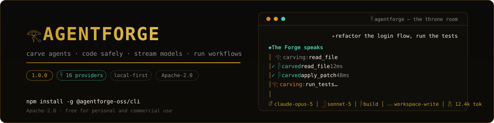
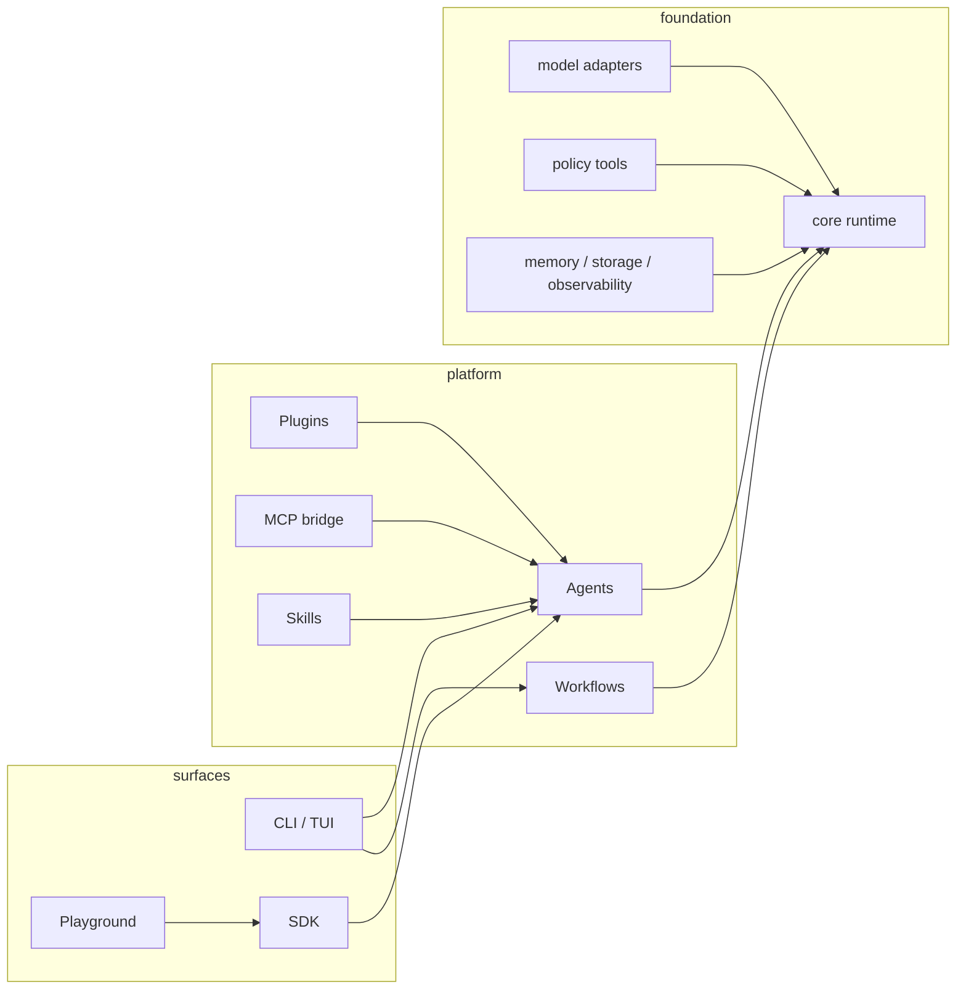

<div align="center">



# AgentForge

**The terminal forge: a model-agnostic agent runtime, coding agent, and extension platform — carved to last.**

[](CHANGELOG.md)
[](package.json)
[](pnpm-workspace.yaml)
[](LICENSE)
[](.github/workflows)
[](#-community)

*Chat-first TUI · subagents & task delegation · skills with staging · persistent memory · LSP intelligence · structured permission rules · session modes · observability & security findings · OpenAI-compatible gateway · daemon · channels · device tools · workflows · plugins · MCP*

</div>

---

## Why AgentForge?

Most agent CLIs lock you into one provider and one way of working. AgentForge is built around three ideas:

1. **The runtime is separate from the product.** A typed agent loop (`@agentforge-oss/core`) with tools, retries, cancellation, and events — consumed by the CLI, the SDK, and the web playground alike.
2. **Extensions are first-class.** Plugins, MCP servers, and markdown skills drop into `.agentforge/extensions.json` and merge into every session automatically.
3. **Dangerous things ask first.** File edits and shell commands run through workspace-scoped tools behind explicit permission modes.

```text
𓂀  AGENTFORGE  𓋴                                                    𓋹 ONLINE
════════════════════════════════════════════════════════════════════════

    ▸ refactor the login flow, run the tests

  ◆ The Forge speaks
│   𓂀 carving: read_file…
│   ✓ 𓋴 carved read_file  12ms
│   ✓ 𓋴 carved apply_patch  48ms
│   ✓ 𓋴 carved run_tests  3.2s
│ Done — 3 files touched, all 14 tests pass.

 𓋴 FORGE > █
  enter send · / commands · ctrl+c cancel turn · ctrl+c twice exit
 𓁈 claude-opus-5 │ 𓃀 sonnet-5 │ 𓋴 build │ 𓂋 workspace-write │ 𓆣 12.4k tok
```

The **Pharaoh's Monument** theme ships by default (obsidian black, Pharaoh's
Gold, Nile turquoise, papyrus white — see `/skin` for `pharaoh-indigo`,
`forge`, `midnight`, and `paper`). Set `AGENTFORGE_GLYPHS=ascii` if your
terminal lacks Egyptian-hieroglyph coverage.

## Install

Packages ship to npm under the `@agentforge-oss` scope — the CLI installs globally and still provides the `agentforge` binary:

```bash
npm install -g @agentforge-oss/cli
agentforge --version          # v0.1.0

# or run it without installing
npx @agentforge-oss/cli chat

# or from source
git clone https://github.com/v01dst/agentforge.git
cd agentforge && pnpm install && pnpm build
node packages/cli/dist/bin.js --help
```

Scaffold your first project (works offline against a deterministic mock model):

```bash
agentforge init my-agent        # or: agentforge init . inside an existing repo
cd my-agent
pnpm install
pnpm exec agentforge chat       # interactive TUI
pnpm run run                     # headless one-shot
```

Connect a real model when you're ready:

```bash
export OPENAI_API_KEY=sk-...     # or ANTHROPIC_API_KEY / GOOGLE_API_KEY
agentforge providers add openrouter \
  --protocol openai-compatible --base-url https://openrouter.ai/api/v1 \
  --model anthropic/claude-sonnet-4.5 --api-key-env OPENROUTER_API_KEY
```

## What's inside

| Surface | Package | What it gives you |
| --- | --- | --- |
| Agent runtime | [`@agentforge-oss/core`](packages/core) | Typed agent loop, tool calling, retries, abort/cancellation, structured output, event bus |
| Model adapters | [`@agentforge-oss/models`](packages/models) | OpenAI · Anthropic · Gemini · OpenAI-compatible (OpenRouter, Ollama, vLLM…) · SSE streaming · deterministic mock |
| Tools | [`@agentforge-oss/tools`](packages/tools) | Zod-typed tool framework + filesystem, HTTP, shell, repository, patch-editing tools |
| Workflows | [`@agentforge-oss/workflows`](packages/workflows) | Versioned workflow documents, graph validation, branching, parallel steps, retries, deterministic replay |
| Memory & storage | [`memory`](packages/memory) · [`storage`](packages/storage) | Pluggable memory providers, run persistence |
| Observability | [`@agentforge-oss/observability`](packages/observability) | Structured events, redaction-aware sinks |
| MCP client | [`@agentforge-oss/mcp`](packages/mcp) | stdio MCP servers → native agent tools |
| CLI + TUI | [`@agentforge-oss/cli`](packages/cli) | Everything below |
| Playground | [`apps/playground`](apps/playground) | Web UI over the same runtime and run store |

## The terminal experience

```bash
agentforge            # chat-first TUI (global mode, or project mode in a repo)
agentforge chat       # explicit interactive session (--plain for pipes/CI)
agentforge run        # one headless turn — perfect for scripting
agentforge doctor     # environment, config, plugins, MCP — with security surfacing
agentforge models list && agentforge models test openrouter
agentforge sessions list|resume|rename|export|prune|fork|transcript
agentforge agents list                # markdown agent definitions + built-in subagents
agentforge skills list|pending|diff|approve|reject
agentforge permissions allow run_command --prefix "git status"
agentforge profile save deep --provider anthropic --model claude-sonnet --mode workspace-write
agentforge runs list|show <runId>     # local-first run event log
agentforge findings list              # observe-only security findings
agentforge benchmarks list|run --all  # deterministic scoring — no model judges
agentforge gateway serve              # OpenAI-compatible endpoint over your agent
agentforge daemon run|status|stop|install
agentforge channels webhook|telegram  # bring chat to the agent
agentforge inspect <run-id>           # runs — or stored sessions with --session
```

Inside a session:

| | |
| --- | --- |
| `/help` `/status` `/clear` `/exit` | session basics |
| `/models` `/model <name>` `/providers` `/connect <p>` | switch models mid-flight |
| `/mode [chat\|build\|indie\|automode]` | **session mode** — how the agent behaves |
| `/permissions [read-only\|ask\|workspace-write\|trusted]` (alias `/posture`) | **posture** — what needs approval |
| `/plan` `/build` | quick posture switches (read-only ↔ workspace-write) |
| `/memory` `/skills [name]` `/agents` | browse memory, skills, and agents |
| `/fork [id]` `/transcript [id]` `/rename` `/show` `/sessions` `/resume` `/new` | durable session control — fork replays the full uncompacted log |
| `/profile [name]` | apply a saved provider/model/posture bundle |
| `/tools` `/workflows` `/runs` `/inspect <id>` `/plugins` `/skin` | inspect what the agent can do and did |

Streaming turns show live token output and SSE streaming from every HTTP provider (OpenAI, Anthropic, Gemini, OpenAI-compatible). Long sessions compact automatically to a recent tail plus a rolling summary. Ctrl-C cancels the current turn, twice exits. Tool calls render inline as they complete. Non-TTY usage degrades to clean plain-text (pipes, CI, `echo "hi" | agentforge chat`).

## Extensions: plugins · MCP · skills

Everything lives in one file — `.agentforge/extensions.json`, created by `agentforge init`:

```json
{
  "plugins": ["./plugins/example.ts"],
  "mcp": {
    "servers": [
      { "name": "files", "command": ["npx", "-y", "@modelcontextprotocol/server-filesystem", "."] }
    ]
  }
}
```

### Plugins — local TypeScript modules

```ts
// plugins/example.ts
import { z } from 'zod';
import type { AgentForgePlugin } from '@agentforge-oss/cli';

const plugin: AgentForgePlugin = {
  name: 'example',
  instructions: 'Prefer concise answers.',
  tools: [{
    name: 'greet',
    description: 'Return a friendly greeting',
    inputSchema: z.object({ name: z.string() }),
    permissions: [],
    async execute({ name }) { return { text: `Hello, ${name}!` }; },
  }],
};

export default plugin;
```

```bash
agentforge plugins add ./plugins/example.ts   # probe-loads before registering
agentforge plugins list                        # shows each plugin's tools
```

### MCP — any stdio server becomes native tools

```bash
agentforge mcp add files -- npx -y @modelcontextprotocol/server-filesystem .
agentforge mcp tools files      # verify connectivity + list adapted tools
```

Tools arrive namespaced (`files.read_file`), schema-validated, tagged with restrictive
`mcp:<server>` permissions, and surfaced in `doctor` — including the exact command that
will be launched, so nothing runs invisibly on your machine.

### Skills — markdown with frontmatter

```markdown
---
name: code-review
description: Review changes carefully before proposing them
---
When reviewing code, check edge cases, error handling, and tests first…
```

Drop files into `.agentforge/skills/`, toggle with `/skills <name>`. Selected skill bodies
are injected into the system context for new turns.

## Safe by default

Repository work goes through seven policy-wrapped coding tools — `list_files`,
`read_file`, `search_text`, `apply_patch`, `inspect_git_diff`, `run_command`, `run_tests` —
scoped to the workspace root and gated by four permission modes:

| Mode | Reads | Edits | Commands |
| --- | --- | --- | --- |
| `read-only` | ✅ | ❌ | ❌ |
| `ask` *(default)* | ✅ | 🔔 approve | 🔔 approve |
| `workspace-write` | ✅ | ✅ in-root | 🔔 allowlisted only |
| `trusted` | ✅ | ✅ | ✅ |

Credentials never touch disk through the CLI, API keys are redacted from logs and errors,
and provider credentials resolve from environment variables only. Hardening beyond the modes:

- **Per-tool rules** — `agentforge permissions deny <tool>` blocks a tool in every mode; `allow` skips its approval prompt. Rules live in `.agentforge/permissions.json` and never bypass workspace path checks.
- **Structured rules (v0.6)** — glob patterns (`mcp.*`), dotted hierarchies (`mcp.server` covers `mcp.server.tool`), command prefixes (`run_command:prefix=git status` carves exceptions out of a broad deny), and `external_directory:` grants. Specificity tiers with deny-precedence; unknown qualifiers fail closed.
- **Secret-file protection** — `read_file`/`search_text` refuse `.env`, key files, `id_rsa`, `.ssh/` and friends unless explicitly opted in.
- **Command containment** — `run_command` is allowlist-only, shell-free, rejects path arguments escaping the workspace, and blocks destructive patterns (`rm -rf ~`, `dd of=/dev/*`, `curl | sh`, …).
- **SSRF-safe HTTP** — redirects are followed manually with every hop re-validated against private-network blocks and host allowlists (including encoded-IP tricks).
- **Doom-loop guard** — a `preTool` interceptor denies the third identical consecutive tool call and tells the model to change approach instead of burning context.

## Power features

Everything below ships in the CLI — no extra installs, all local-first:

- **Subagents & task delegation** — markdown agent definitions in `.agentforge/agents/` (frontmatter: `mode`, `description`, `model`, `steps`, `permission`). The `task` tool spawns child agent runs with posture-filtered toolsets; built-in `explore` (read-only) and `general` subagents; `@mention` hints in chat; `/agents` browser.
- **Skills with staging** — folders with `SKILL.md` + reference files load progressively (index in context, bodies on demand). Agent-authored skill writes are staged under `.agentforge/pending/skills/` and land only after human `approve`.
- **Persistent memory & persona** — `MEMORY.md` / `USER.md` with capacity accounting, the `memory` tool, and `.agentforge/SOUL.md` + `AGENTS.md` injected as a frozen snapshot at session start.
- **LSP intelligence** — a real JSON-RPC stdio client (TS-first: `typescript-language-server` by default; custom servers in `.agentforge/lsp.json`). `lsp_diagnostics` and `lsp_hover` as observe-only tools.
- **Session log-as-truth** — every turn appends to an NDJSON log that compaction never touches; `sessions fork` replays full history into a new session with `forkedFrom` lineage.
- **Observability & security findings** — structured run events under `.agentforge/observability/` (`agentforge runs show <id>`), plus a deterministic findings scanner that records secret-shaped inputs, risky shell patterns, and credential-file probes — **observe-only, never gates**.
- **OpenAI-compatible gateway** — `agentforge gateway serve` exposes your agent at `POST /v1/chat/completions` (SSE streaming included); any OpenAI-protocol client can talk to it.
- **Daemon** — `agentforge daemon run` heartbeats and drains JSON job files; `install` writes a supervised launchd/systemd unit; `status`/`stop` included.
- **Channels** — `agentforge channels webhook` (HMAC-verified `POST /hook`) and `channels telegram` (long-polling bot with chat allowlist) pipe external chat into the agent.
- **Device tools** — `device_notify`, `device_open_url`, clipboard read/write, and `device_screenshot`, all behind `process:execute` so the policy layer covers them.
- **Profiles & modes** — `profile save deep --provider anthropic --model claude-sonnet --mode workspace-write` then `profile use deep`; session modes (`chat`/`build`/`indie`/`automode`) layer behavior on top of postures.

## Workflows as documents

Workflows are plain, versioned JSON — no code inside the document. Behavior is attached at
compile time through named handlers and live agent/model/tool instances:

```json
{
  "version": 1,
  "name": "triage",
  "start": "start",
  "nodes": [
    { "id": "start", "type": "input" },
    { "id": "gate", "type": "condition", "handler": "needsReview" },
    { "id": "review", "type": "transform", "handler": "flagForHuman", "retries": 1 },
    { "id": "out", "type": "output" }
  ],
  "edges": [
    { "from": "start", "to": "gate" },
    { "from": "gate", "to": "review", "label": "true" },
    { "from": "gate", "to": "out", "label": "false" },
    { "from": "review", "to": "out" }
  ]
}
```

```bash
agentforge workflows validate triage.json   # precise structural errors before anything runs
```

`compileWorkflowDocument` turns a validated document into the executable graph; the engine
runs branching, parallel fan-out, and per-node retries with deterministic, JSON-serializable
step histories you can replay and audit.

## Architecture



Strict TypeScript end-to-end · Zod at every runtime boundary · typed errors · cancellation preserved throughout · deterministic mocks for tests.

## Repository map

```text
agentforge/
├── apps/playground/        web console over the same runtime
├── packages/
│   ├── core/               agent loop, contracts, events
│   ├── models/             openai · anthropic · google · openai-compatible · mock
│   ├── tools/              typed tool framework + built-ins
│   ├── workflows/          graph runtime
│   ├── memory/ storage/ observability/
│   ├── mcp/                MCP stdio client → ToolLike adapter
│   ├── cli/                TUI, commands, extensions loader
│   └── sdk/                consolidated public exports
├── examples/showcase/      runnable provider/tool/workflow examples
├── docs/                   assets
└── PROJECT_STATUS_AND_ROADMAP.md   ← the honest, living status doc
```

## Development

```bash
pnpm install
pnpm build          # all packages
pnpm test           # deterministic suites (no network)
pnpm typecheck && pnpm lint
```

See [AGENTS.md](AGENTS.md) for contributor conventions and [CONTRIBUTING.md](CONTRIBUTING.md)
for PR expectations. The roadmap is maintained as a truthful status document — read
[§15 Near-Term Work Plan](PROJECT_STATUS_AND_ROADMAP.md) before picking up an issue.

## Status

AgentForge carries the complete adoption-plan feature set — persistent memory, an interceptor
seam with a v2 plugin kernel, staged skills, observe-only reflection, prompt caching + live
context compression, markdown agents with `task` delegation, structured permission rules with
a doom-loop guard, NDJSON session logs with forking, an LSP bridge, profiles, a local-first
observability core, security findings, session modes, an OpenAI-compatible gateway, a
supervised daemon, deterministic benchmarks, webhook/Telegram channels, desktop device tools,
and the Pharaoh's Monument TUI with ez-start onboarding and live model discovery across 16
providers — verified by ~282 deterministic tests. The 1.0 line begins at version `0.1.0`
(in-repo; registry numbers were consumed by earlier development releases). Experimental but
hard at work; APIs may still change.

See [CHANGELOG.md](CHANGELOG.md) for the release history and
[PROJECT_STATUS_AND_ROADMAP.md](PROJECT_STATUS_AND_ROADMAP.md) for the honest gap list.

## Community

- **Discord:** [`9p.1`](https://discord.com) — say hi, share agents, ask questions.
- **Issues:** [github.com/v01dst/agentforge/issues](https://github.com/v01dst/agentforge/issues)

## License

[Apache-2.0](LICENSE) — free to use, modify, and distribute, **including commercial use**.
No paid license, no restrictions beyond the standard Apache 2.0 terms.
