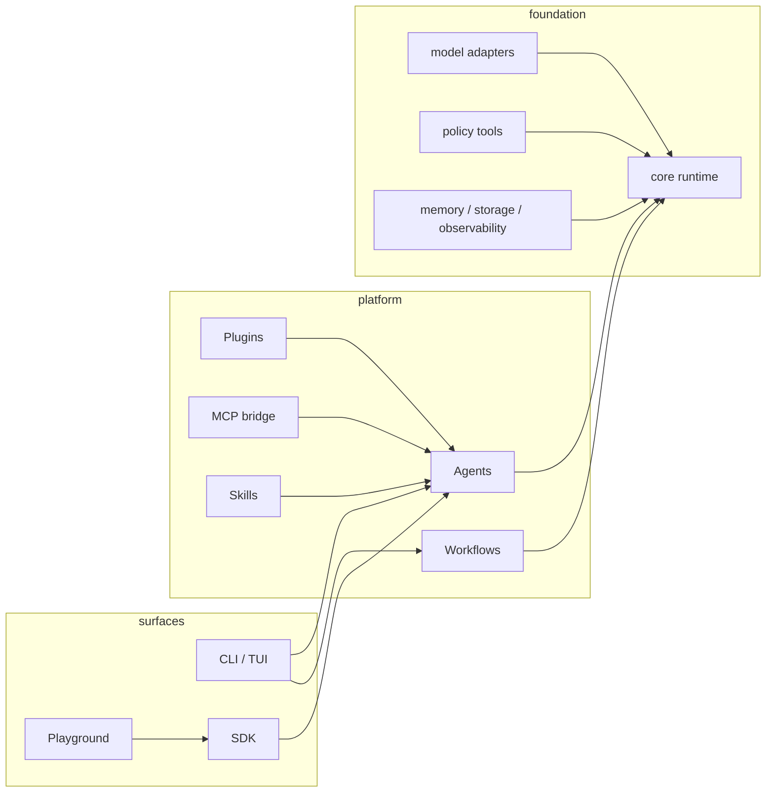

<div align="center">


# AgentForge

**A model-agnostic agent runtime, terminal coding agent, and extension platform — in one TypeScript monorepo.**

[](CHANGELOG.md)
[](package.json)
[](pnpm-workspace.yaml)
[](LICENSE)
[](.github/workflows)
[](#-community)

*Chat-first TUI · provider streaming · permission-gated coding tools · durable sessions · workflow documents · plugins · MCP · skills*

</div>

---

## Why AgentForge?

Most agent CLIs lock you into one provider and one way of working. AgentForge is built around three ideas:

1. **The runtime is separate from the product.** A typed agent loop (`@agentforge-oss/core`) with tools, retries, cancellation, and events — consumed by the CLI, the SDK, and the web playground alike.
2. **Extensions are first-class.** Plugins, MCP servers, and markdown skills drop into `.agentforge/extensions.json` and merge into every session automatically.
3. **Dangerous things ask first.** File edits and shell commands run through workspace-scoped tools behind explicit permission modes.

```text
┌──────────────────────────────────────────────────────────────┐
│  note › AgentForge ready — type a message, or / for commands │
│  you   › refactor the login flow and run the tests           │
│  ⠙ working… (Ctrl-C to cancel)                               │
│  ✓ read_file   src/auth/login.ts (12ms)                      │
│  ✓ apply_patch src/auth/login.ts (48ms)                      │
│  ✓ run_tests    (3.2s)                                       │
│  agent › Done — 3 files touched, all 14 tests pass.          │
│ ╭──────────────────────────────────────────────────╮         │
│ │ ❯ ▏                                              │         │
│ ╰──────────────────────────────────────────────────╯         │
│ claude-sonnet-4-5 · plugins: 2 · mcp: 1 · 12.4k tok          │
└──────────────────────────────────────────────────────────────┘
```

## Install

Packages ship to npm under the `@agentforge-oss` scope — the CLI installs globally and still provides the `agentforge` binary:

```bash
npm install -g @agentforge-oss/cli
agentforge --version          # v0.0.2

# or run it without installing
npx @agentforge-oss/cli chat

# or from source
git clone https://github.com/v01dst/agentforge.git
cd agentforge && pnpm install && pnpm build
node packages/cli/dist/bin.js --help
```

Scaffold your first project (works offline against a deterministic mock model):

```bash
agentforge init my-agent        # or: agentforge init . inside an existing repo
cd my-agent
pnpm install
pnpm exec agentforge chat       # interactive TUI
pnpm run run                     # headless one-shot
```

Connect a real model when you're ready:

```bash
export OPENAI_API_KEY=sk-...     # or ANTHROPIC_API_KEY / GOOGLE_API_KEY
agentforge providers add openrouter \
  --protocol openai-compatible --base-url https://openrouter.ai/api/v1 \
  --model anthropic/claude-sonnet-4.5 --api-key-env OPENROUTER_API_KEY
```

## What's inside

| Surface | Package | What it gives you |
| --- | --- | --- |
| Agent runtime | [`@agentforge-oss/core`](packages/core) | Typed agent loop, tool calling, retries, abort/cancellation, structured output, event bus |
| Model adapters | [`@agentforge-oss/models`](packages/models) | OpenAI · Anthropic · Gemini · OpenAI-compatible (OpenRouter, Ollama, vLLM…) · SSE streaming · deterministic mock |
| Tools | [`@agentforge-oss/tools`](packages/tools) | Zod-typed tool framework + filesystem, HTTP, shell, repository, patch-editing tools |
| Workflows | [`@agentforge-oss/workflows`](packages/workflows) | Versioned workflow documents, graph validation, branching, parallel steps, retries, deterministic replay |
| Memory & storage | [`memory`](packages/memory) · [`storage`](packages/storage) | Pluggable memory providers, run persistence |
| Observability | [`@agentforge-oss/observability`](packages/observability) | Structured events, redaction-aware sinks |
| MCP client | [`@agentforge-oss/mcp`](packages/mcp) | stdio MCP servers → native agent tools |
| CLI + TUI | [`@agentforge-oss/cli`](packages/cli) | Everything below |
| Playground | [`apps/playground`](apps/playground) | Web UI over the same runtime and run store |

## The terminal experience

```bash
agentforge            # chat-first TUI (global mode, or project mode in a repo)
agentforge chat       # explicit interactive session (--plain for pipes/CI)
agentforge run        # one headless turn — perfect for scripting
agentforge doctor     # environment, config, plugins, MCP — with security surfacing
agentforge models list
agentforge models test openrouter   # one-shot provider connectivity probe
agentforge providers add <name> --protocol openai-compatible --base-url …
agentforge sessions list|resume|rename|export|prune
agentforge permissions allow|deny <tool>
agentforge workflows validate <file.json>
agentforge inspect <run-id>         # runs — or stored sessions with --session
```

Inside a session:

| | |
| --- | --- |
| `/help` `/status` `/clear` `/exit` | session basics |
| `/models` `/model <name>` `/providers` `/connect <p>` | switch models mid-flight |
| `/tools` `/workflows` `/runs` `/inspect <id>` | inspect what the agent can do and did |
| `/mode [read-only\|ask\|workspace-write\|trusted]` | permission posture for edits & commands |
| `/rename <title>` `/show [id]` `/sessions` `/resume [id]` `/new` | durable session control |
| `/plugins` `/skills` `/skin [name]` | browse extensions and themes |

Streaming turns show live token output and SSE streaming from every HTTP provider (OpenAI, Anthropic, Gemini, OpenAI-compatible). Long sessions compact automatically to a recent tail plus a rolling summary. Ctrl-C cancels the current turn, twice exits. Tool calls render inline as they complete. Non-TTY usage degrades to clean plain-text (pipes, CI, `echo "hi" | agentforge chat`).

## Extensions: plugins · MCP · skills

Everything lives in one file — `.agentforge/extensions.json`, created by `agentforge init`:

```json
{
  "plugins": ["./plugins/example.ts"],
  "mcp": {
    "servers": [
      { "name": "files", "command": ["npx", "-y", "@modelcontextprotocol/server-filesystem", "."] }
    ]
  }
}
```

### Plugins — local TypeScript modules

```ts
// plugins/example.ts
import { z } from 'zod';
import type { AgentForgePlugin } from '@agentforge-oss/cli';

const plugin: AgentForgePlugin = {
  name: 'example',
  instructions: 'Prefer concise answers.',
  tools: [{
    name: 'greet',
    description: 'Return a friendly greeting',
    inputSchema: z.object({ name: z.string() }),
    permissions: [],
    async execute({ name }) { return { text: `Hello, ${name}!` }; },
  }],
};

export default plugin;
```

```bash
agentforge plugins add ./plugins/example.ts   # probe-loads before registering
agentforge plugins list                        # shows each plugin's tools
```

### MCP — any stdio server becomes native tools

```bash
agentforge mcp add files -- npx -y @modelcontextprotocol/server-filesystem .
agentforge mcp tools files      # verify connectivity + list adapted tools
```

Tools arrive namespaced (`files.read_file`), schema-validated, tagged with restrictive
`mcp:<server>` permissions, and surfaced in `doctor` — including the exact command that
will be launched, so nothing runs invisibly on your machine.

### Skills — markdown with frontmatter

```markdown
---
name: code-review
description: Review changes carefully before proposing them
---
When reviewing code, check edge cases, error handling, and tests first…
```

Drop files into `.agentforge/skills/`, toggle with `/skills <name>`. Selected skill bodies
are injected into the system context for new turns.

## Safe by default

Repository work goes through seven policy-wrapped coding tools — `list_files`,
`read_file`, `search_text`, `apply_patch`, `inspect_git_diff`, `run_command`, `run_tests` —
scoped to the workspace root and gated by four permission modes:

| Mode | Reads | Edits | Commands |
| --- | --- | --- | --- |
| `read-only` | ✅ | ❌ | ❌ |
| `ask` *(default)* | ✅ | 🔔 approve | 🔔 approve |
| `workspace-write` | ✅ | ✅ in-root | 🔔 allowlisted only |
| `trusted` | ✅ | ✅ | ✅ |

Credentials never touch disk through the CLI, API keys are redacted from logs and errors,
and provider credentials resolve from environment variables only. Hardening beyond the modes:

- **Per-tool rules** — `agentforge permissions deny <tool>` blocks a tool in every mode; `allow` skips its approval prompt. Rules live in `.agentforge/permissions.json` and never bypass workspace path checks.
- **Secret-file protection** — `read_file`/`search_text` refuse `.env`, key files, `id_rsa`, `.ssh/` and friends unless explicitly opted in.
- **Command containment** — `run_command` is allowlist-only, shell-free, rejects path arguments escaping the workspace, and blocks destructive patterns (`rm -rf ~`, `dd of=/dev/*`, `curl | sh`, …).
- **SSRF-safe HTTP** — redirects are followed manually with every hop re-validated against private-network blocks and host allowlists (including encoded-IP tricks).

## Workflows as documents

Workflows are plain, versioned JSON — no code inside the document. Behavior is attached at
compile time through named handlers and live agent/model/tool instances:

```json
{
  "version": 1,
  "name": "triage",
  "start": "start",
  "nodes": [
    { "id": "start", "type": "input" },
    { "id": "gate", "type": "condition", "handler": "needsReview" },
    { "id": "review", "type": "transform", "handler": "flagForHuman", "retries": 1 },
    { "id": "out", "type": "output" }
  ],
  "edges": [
    { "from": "start", "to": "gate" },
    { "from": "gate", "to": "review", "label": "true" },
    { "from": "gate", "to": "out", "label": "false" },
    { "from": "review", "to": "out" }
  ]
}
```

```bash
agentforge workflows validate triage.json   # precise structural errors before anything runs
```

`compileWorkflowDocument` turns a validated document into the executable graph; the engine
runs branching, parallel fan-out, and per-node retries with deterministic, JSON-serializable
step histories you can replay and audit.

## Architecture



Strict TypeScript end-to-end · Zod at every runtime boundary · typed errors · cancellation preserved throughout · deterministic mocks for tests.

## Repository map

```text
agentforge/
├── apps/playground/        web console over the same runtime
├── packages/
│   ├── core/               agent loop, contracts, events
│   ├── models/             openai · anthropic · google · openai-compatible · mock
│   ├── tools/              typed tool framework + built-ins
│   ├── workflows/          graph runtime
│   ├── memory/ storage/ observability/
│   ├── mcp/                MCP stdio client → ToolLike adapter
│   ├── cli/                TUI, commands, extensions loader
│   └── sdk/                consolidated public exports
├── examples/showcase/      runnable provider/tool/workflow examples
├── docs/                   assets
└── PROJECT_STATUS_AND_ROADMAP.md   ← the honest, living status doc
```

## Development

```bash
pnpm install
pnpm build          # all packages
pnpm test           # deterministic suites (no network)
pnpm typecheck && pnpm lint
```

See [AGENTS.md](AGENTS.md) for contributor conventions and [CONTRIBUTING.md](CONTRIBUTING.md)
for PR expectations. The roadmap is maintained as a truthful status document — read
[§15 Near-Term Work Plan](PROJECT_STATUS_AND_ROADMAP.md) before picking up an issue.

## Status

AgentForge **v0.0.2** is an experimental foundation that already does real work:
multi-turn streaming chat with durable sessions (rename/export/prune/compaction), repository-aware
tools behind per-tool permission rules, SSE provider streaming with conformance fixtures,
`models test` probes, plugins/MCP/skills, versioned workflow documents, run inspection, and a
playground — verified by ~257 deterministic tests. Not yet production-stable; APIs may change
before `0.1`.

See [CHANGELOG.md](CHANGELOG.md) for the release history and
[PROJECT_STATUS_AND_ROADMAP.md](PROJECT_STATUS_AND_ROADMAP.md) for the honest gap list.

## Community

- **Discord:** [`9p.1`](https://discord.com) — say hi, share agents, ask questions.
- **Issues:** [github.com/v01dst/agentforge/issues](https://github.com/v01dst/agentforge/issues)

## License

[Apache-2.0](LICENSE)
