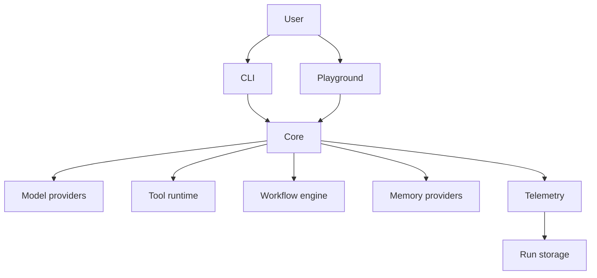

# AgentForge

AgentForge is an open-source, model-agnostic TypeScript framework for building, executing, testing, and observing AI agents and visual workflows.

The project keeps provider-specific code behind adapters, treats tools as typed capabilities, and exposes the same runtime to the SDK, CLI, and playground.

## Install

```bash
# Install the CLI globally
npm install -g @agentforge-oss/cli
agentforge init my-agent
cd my-agent
agentforge chat
```

> **Note:** the npm package is `@agentforge-oss/cli` (the `agentforge` name on npm is blocked by similarity rules). Installing it globally still provides the `agentforge` binary.

## Status

Version `0.2.0` adds the chat-first interactive TUI (`agentforge` launches straight into it) on top of the 0.1.0 runtime. Core APIs are usable for local development and testing; provider adapters, persistence, and the playground are evolving and may change before `1.0.0`.

## Architecture



The monorepo is split into small packages:

- `@agentforge-oss/core`: agent runtime, events, and public types
- `@agentforge-oss/models`: provider adapters and deterministic mock models
- `@agentforge-oss/tools`: typed tool definitions and built-in tools
- `@agentforge-oss/workflows`: graph execution and workflow nodes
- `@agentforge-oss/memory`: conversation and long-term memory providers
- `@agentforge-oss/observability`: structured logs and event sinks
- `@agentforge-oss/storage`: execution-history persistence
- `agentforge`: the `agentforge` developer CLI

## Quick start

```bash
pnpm install
pnpm build
pnpm test
pnpm --filter agentforge dev -- --help
```

Install the CLI globally, create a project, install its dependencies, and launch the interactive agent:

```bash
npm install -g @agentforge-oss/cli
agentforge init my-agent
cd my-agent
npm install
agentforge
```

For a project-local CLI installation, use `npx agentforge` or `npm start`; npm does not add local package binaries to the global shell PATH.

No paid API account is required for the examples. They use the deterministic mock model. Provider adapters read credentials only from environment variables:

```bash
export OPENAI_API_KEY=...
export ANTHROPIC_API_KEY=...
export GOOGLE_API_KEY=...
```

## Basic agent

```ts
import { Agent } from '@agentforge-oss/core';
import { MockModel } from '@agentforge-oss/models';

const agent = new Agent({
  name: 'assistant',
  model: new MockModel({ responses: ['AgentForge is ready.'] }),
  instructions: 'Answer concisely and honestly.',
});

const result = await agent.run('What is AgentForge?');
console.log(result.output);
```

## Typed tools

```ts
import { defineTool } from '@agentforge-oss/tools';
import { z } from 'zod';

const calculator = defineTool({
  name: 'calculator',
  description: 'Evaluate a simple arithmetic expression.',
  input: z.object({ expression: z.string().min(1) }),
  execute: async ({ expression }) => ({ expression, value: 42 }),
});
```

Tools validate input at the runtime boundary and can declare timeouts, retries, permissions, and lifecycle hooks. Shell and filesystem capabilities are opt-in and should be isolated in production.

## Workflows

Workflow graphs compose input, agent, model, tool, transform, condition, parallel, approval, and output nodes. See [`examples/showcase/research-workflow.ts`](examples/showcase/research-workflow.ts) for a deterministic end-to-end graph.

## Observability and memory

Every run receives a unique run ID and emits structured events such as `agent.started`, `model.completed`, `tool.completed`, and `agent.failed`. Plug in a console sink for local development or a storage-backed sink for history. Memory is provider-based; the in-memory implementation is included and PostgreSQL is available behind the storage package.

## CLI

```text
agentforge init <name>       Scaffold a project
agentforge dev               Start the local development server
agentforge                    Start interactive chat in the current project
agentforge run <entry>       Execute an agent or workflow entrypoint
agentforge chat <entry>      Start interactive chat explicitly
agentforge connect <provider> Connect a built-in or custom provider
agentforge test              Run deterministic agent tests
agentforge inspect <run-id>  Inspect a stored run
agentforge providers         List configured model providers
agentforge tools             List available tools
agentforge workflows         List workflow definitions
```

Inside chat, use `/help`, `/connect <provider-or-module>`, `/providers`, `/status`, `/model <name>`, `/clear`, and `/exit`. Custom provider modules may export a `ModelProvider` as `default`/`model`, or a `createProvider(options)`/`createModel(options)` factory. Configuration is discovered from `agentforge.config.ts`; credentials supplied with `connect` remain process-local and are never printed.

## Security

AgentForge validates inputs and outputs, enforces execution limits, redacts common secret formats in logs, and requires explicit opt-in for dangerous tools. HTTP tools should enforce an allowlist and block private network targets to reduce SSRF risk. Review [`SECURITY.md`](SECURITY.md) before enabling shell execution in an untrusted process.

## Development

```bash
pnpm lint
pnpm typecheck
pnpm test
pnpm build
```

See [`CONTRIBUTING.md`](CONTRIBUTING.md) for package boundaries, tests, and pull requests. The roadmap tracks provider parity, durable workflow persistence, and playground improvements.

## License

AgentForge is released under the Apache License 2.0. See [`LICENSE`](LICENSE).
